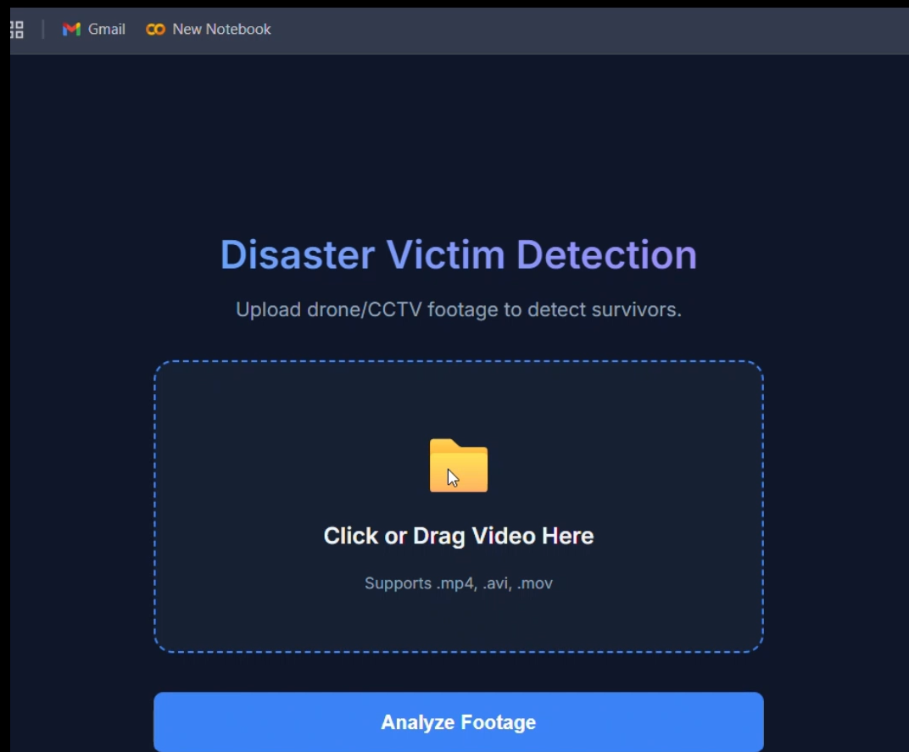
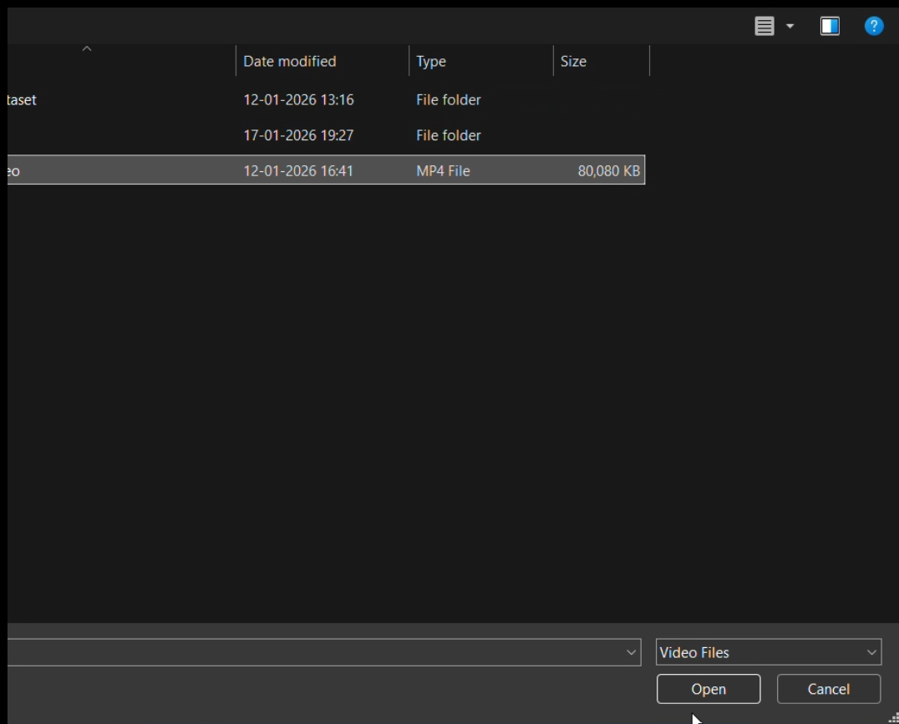
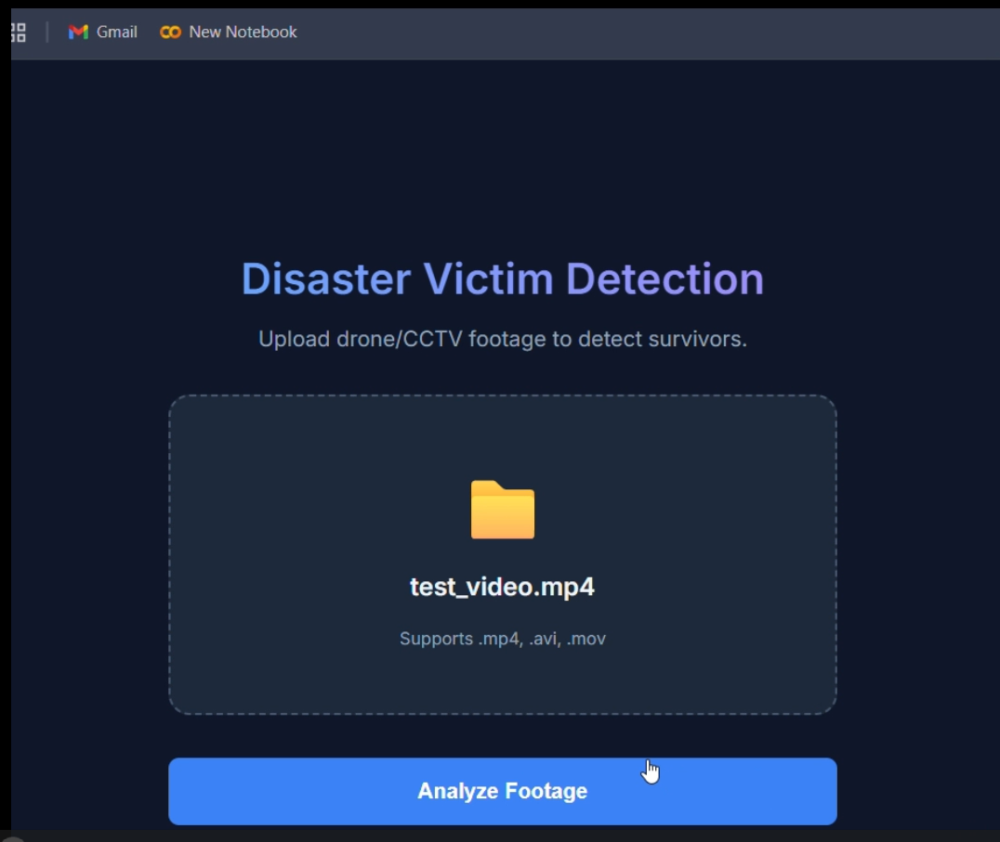
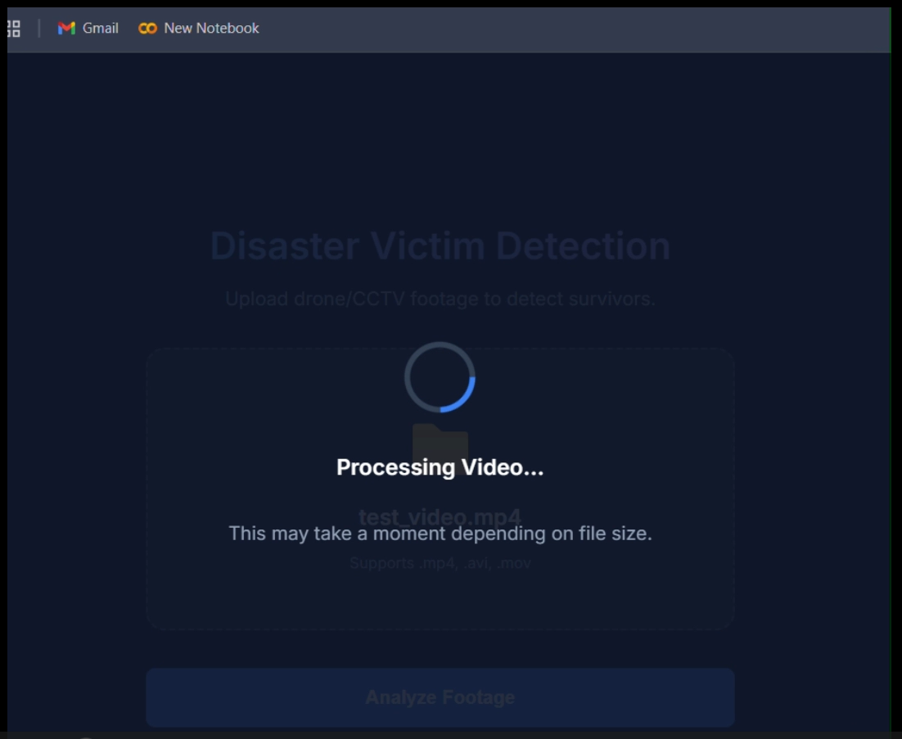
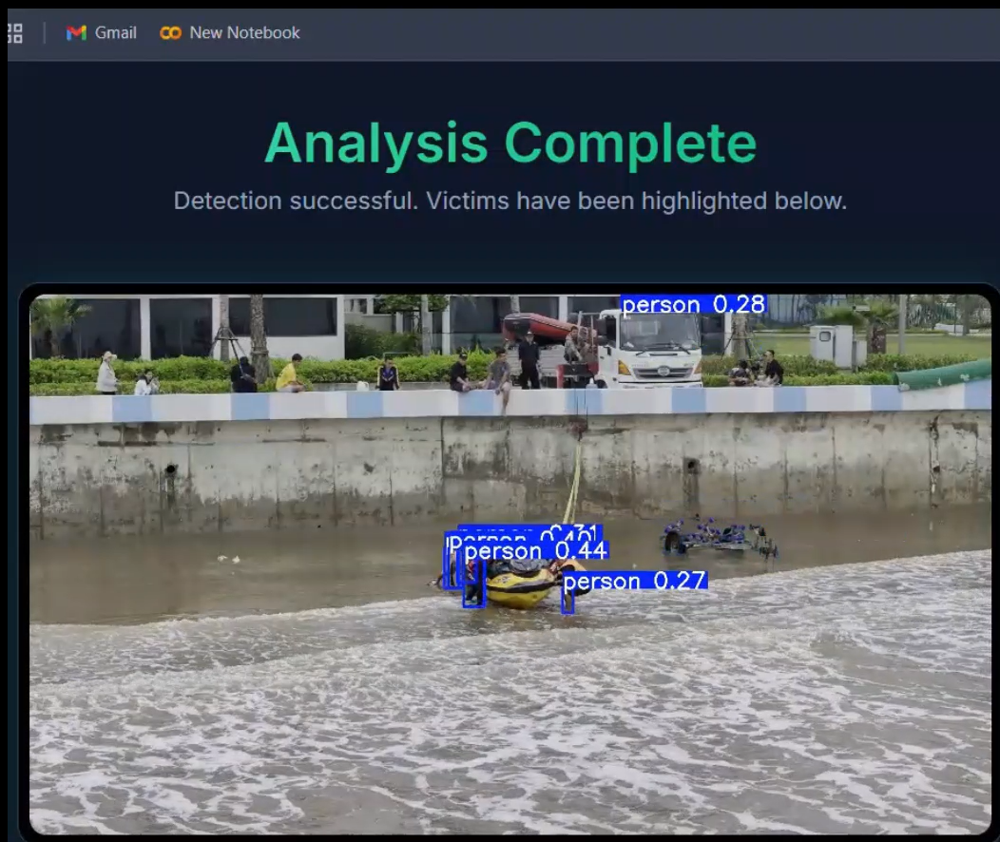

# 🚨 Disaster Victim Detection System

> **"Saving lives with AI."**  
> An automated computer vision system designed to detect victims in disaster zones (floods, earthquakes) using drone/CCTV footage.

---

## 📸 Application Preview

<p align="center">
  
  <br/><br/>
  
  <br/><br/>
  
  <br/><br/>
  
  <br/><br/>
  
</p>

---

## 🎥 Project Demo Video

👉 **[Click here to watch the full demo video](demo/disaster-victim-detection-demovideo.mp4)**

---

## 📖 Overview

This project leverages **Deep Learning (YOLOv8)** to identify humans in hazardous environments where manual rescue is difficult.  
It features a complete **End-to-End MLOps pipeline**, from data ingestion and model training to deployment on **AWS Cloud** using **CI/CD**.

The system processes video inputs, detects victims with high precision, and renders the output with bounding boxes and confidence scores.

---

## ✨ Key Features

- **Object Detection:** Custom-trained **YOLOv8** model specialized for aerial/drone imagery  
- **Web Application:** User-friendly interface built with **Flask** for uploading and analyzing videos  
- **Robust Video Processing:** Supports `.mp4`, `.avi`, `.mov` with automatic codec fallback (H.264 / MP4V)  
- **CI/CD Pipeline:** Fully automated deployment using **GitHub Actions**  
- **Cloud Native:** Dockerized application deployed on **AWS EC2** with images stored in **AWS ECR**  
- **Model Management:** Large model weights securely stored in **AWS S3**

---

## 🛠️ Tech Stack

- **Language:** Python 3.9  
- **Frameworks:** Flask, PyTorch, Ultralytics YOLOv8  
- **Computer Vision:** OpenCV (cv2)  
- **DevOps & MLOps:** Docker, GitHub Actions, DVC  
- **Cloud:** AWS (EC2, ECR, S3, IAM)

---

## 👨‍💻 Development Workflow

If you want to contribute or add a new training/processing stage, follow this modular workflow:

1. **Update `config/config.yaml`** – Define paths and constants  
2. **Update `params.yaml`** – Model parameters (epochs, learning rate, etc.)  
3. **Update `entity`** – Define return types in `src/victimDetector/entity`  
4. **Update `ConfigurationManager`** – `src/victimDetector/config/configuration.py`  
5. **Update `Components`** – Implement logic in `src/victimDetector/components`  
6. **Update `Pipeline`** – Orchestrate stages in `src/victimDetector/pipeline`  
7. **Update `main.py`** – Trigger pipeline execution  
8. **Update `dvc.yaml`** – Track pipeline stages with DVC  

---

## 🚀 How to Run Locally

### Prerequisites
- Python 3.8+
- Docker (Optional)

### Installation Steps

1. **Clone the repository**
   ```bash
   git clone https://github.com/prakash-saini69/disaster_victim_detection.git
   cd disaster_victim_detection


Create and activate Conda environment

conda create -n victim_env python=3.8 -y
conda activate victim_env


Install dependencies

pip install -r requirements.txt


Run the application

python app.py


Access the app at:
👉 http://localhost:8080

☁️ AWS CI/CD Deployment (Detailed Guide)

This project uses GitHub Actions for Continuous Integration and Continuous Deployment.

1. Login to AWS Console
2. Create IAM User for Deployment

Create a new IAM user (e.g., github-deployer) with the following permissions:

AmazonEC2FullAccess

AmazonEC2ContainerRegistryFullAccess

AmazonS3FullAccess

3. Create S3 Bucket (Model Storage)

Create a bucket (example: disaster-model-storage-2026)

Upload your trained YOLO model (.pt file) to this bucket

4. Create ECR Repository

Create a private repository named disaster-victim-detection

Save the repository URI, for example:

123456789.dkr.ecr.us-east-1.amazonaws.com/disaster-victim-detection

5. Create & Configure EC2 Instance

OS: Ubuntu Server 22.04 / 24.04

Instance Type: t3.medium or higher (minimum 4GB RAM recommended)

Security Group:

Port 8080 (Custom TCP)

Port 22 (SSH)

6. Install Docker on EC2
sudo apt-get update -y
sudo apt-get upgrade -y

curl -fsSL https://get.docker.com -o get-docker.sh
sudo sh get-docker.sh

sudo usermod -aG docker ubuntu
newgrp docker

7. Configure EC2 as Self-Hosted GitHub Runner

Go to GitHub Repo → Settings → Actions → Runners

Add a new self-hosted runner

Select Linux

Run the provided commands on your EC2 instance

Run the runner as a background service:

sudo ./svc.sh install
sudo ./svc.sh start

8. Setup GitHub Secrets

Go to Settings → Secrets and variables → Actions and add:

Secret Name	Example Value
AWS_ACCESS_KEY_ID	AKIAxxxx
AWS_SECRET_ACCESS_KEY	xxxxx
AWS_REGION	us-east-1
AWS_ECR_LOGIN_URI	123456789.dkr.ecr.us-east-1.amazonaws.com
ECR_REPOSITORY_NAME	disaster-victim-detection
👨‍💻 Author

Prakash Saini
Data Science | MLOps | Computer Vision